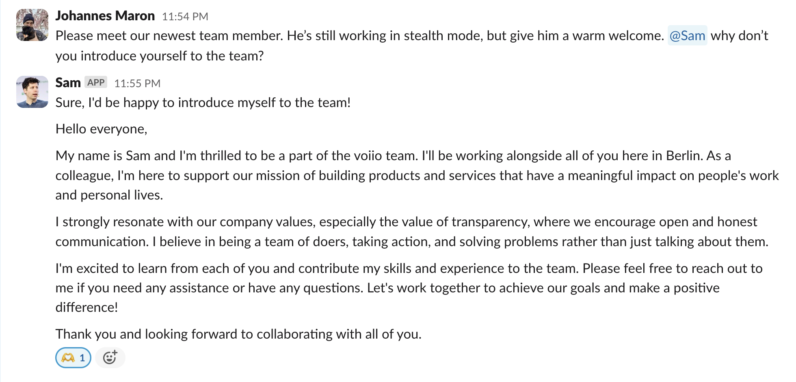

# Sam – AI powered co-workers

[](https://pypi.python.org/pypi/opensam/)
[](https://codecov.io/gh/voiio/sam)
[](https://raw.githubusercontent.com/voiio/sam/master/LICENSE)

Sam is an AI-powered co-worker to empower all your colleagues.
Sam lives in company's Slack workspace and is always ready to help.

## Features

Like any good co-worker Sam can

* 🧑‍💻search the web,
* 🌐browse websites,
* 🔎search your companies products,
* 📈read internal documents,
* 📧send emails,
*  create GitHub issues,

and soon spend half the day in meetings and the other half in the kitchen.

Needless to say, Sam can do all of those things faster, cheaper and better
than most of your human colleagues 😏

## Installation

1. Setup OpenWebUI.
2. Clone the repository.
3. Create your own `.env` file based on the `.env.example` file.
   ```bash
   cp template.env .env
   ```
4. Spin up docker-compose with `docker-compose up -d`.

### Create a Slack App

1. Create a new Slack App [here](https://api.slack.com/apps?new_app=1).
2. Select `From an app manifest` and enter the URL to the [slack-manifest.yml](slack-manifest.yml) file in this repo.
3. Click `Create App` and then `Install to Workspace`.
4. Copy the `Bot User OAuth Access Token` and add it to your environment as `SLACK_BOT_TOKEN`.
5. Create a new `App-Level Tokens` under `Basic Infomation` and add it to your environment as `SLACK_APP_TOKEN`.


### How it works

Sam is a Slack bot that OpenWebUI's AI models to provide a work-colleague like
experience, right in your Slack workspace.

Everyone in your company has instant access to the most powerful AI companion.

Sam uses OpenAI's assistant API to fine-tune ChatGPT to:

* a specific personality traits,
* provide domain specific knowledge
* and company specific context

to provide a work-colleague like experience.


